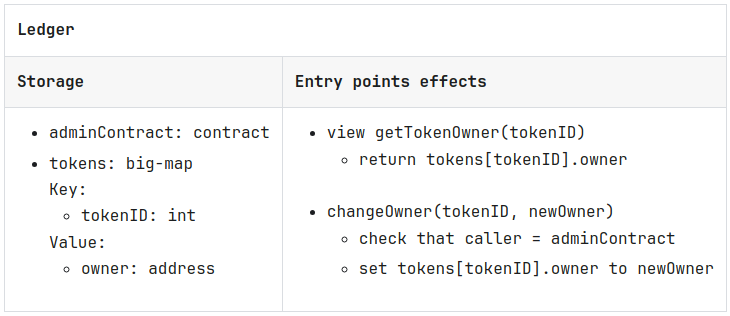

# This is the coursework for Turing WEB3 dev course module2sprint3.

## PART 2

### Security and vurneability of smart contracts

Material from --> [Avoiding flaws](https://opentezos.com/smart-contracts/avoiding-flaws)

1. **Using source instead of sender for authentication**  
	Example - charity where entry points calling is being verified with the source. If someone would be able to initially pretend to be a charity that eventually receives any/small donation from the contract, then the default entrypoint of this scammer charity contract might envoke the donate entrypoint from the original charity contract. And since the source of original donation made from charity contract to scam charity would be the admin who creted the charity contract, that source then continues to be the source for the scam charity donate invocation.

2. **Transferring tez in a call that should benefit others**  
    example - including the transfer into an entrypoint actions of the contract. Sending tez to an address may fail if the address is that of a contract that doesn't accept transfers. This can cause the entire call to fail, which is very problematic if that call is important for other users affected by the entrypoint actions.

    ### **Best practice**
    - One idea could be to only allow implicit accounts as the destination of transfers of tez, as implicit accounts may never reject a transfer of tez.

    - This is possible but not recommended, as it limits the usage of the contract, and for example prevents the use of multi-sigs or DAOs as the authors of NFTs.

    - A better solution is to avoid directly transferring tez from an entry point that does other operations, and instead, let the destination of that transfer fetch the funds themselves. 

3. **Performing unlimited computations**
    1. Prevent data from growing too much
        - make it expensive, by requesting a minimum deposit for each call that increases the size of the stored data.
        - set a hard limit, by rejecting any call that increases the size of the stored data beyond a given limit.
    2. Store data in a big-map
        
        Unless it's already in the cache, all data in the storage of a contract needs to be loaded and deserialized when the contract is called, and reserialized afterwards. Long lists, sets or maps therefore can increase gas consumption very significantly, to the point that it exceeds the limit per operation.

        Big-maps are the exception: instead of being deserialized/reserialized entirely for every call, only the entries that are read or written are deserialized, on demand, during the execution of the contract.

        Using big-map allows contracts to store unlimited data. The only practical limit is the time and costs of adding new entries.

    3. Do computations off-chain

4. **Needlessly relying on one entity to perform a step**  

    > Relying on one entity involved in a contract to perform a step that shouldn't require that entity's approval, breaks the trustless benefits that a smart contract is intended to provide. In some cases, it may cause funds to get locked in the contract, for example if this entity becomes permanently unavailable.

    for example, in a auction contract, once the auction has ended, calling the claimNFT entrypoint should not be limited to either the topbidder nor the seller of the asset. The calling could be done by anyone, the contract just needs to make sure appropriate persons receive the funds and assets.

    ### **Best practice**  
    When reviewing a contract, go through every entry point and ask: **"What if someone doesn't call it?"**

    If something bad would happen, consider these approaches to reduce the risk:

    1) Make it so that other people can call the entry point, either by letting anyone call it, if it is safe, or by having the caller be a multi-sig contract, where only a subset of the people behind that multi-sig need to be available for the call to be made.

    2) Add financial incentives, with a deposit from the entity supposed to call the entry point, that they get back when they make the call. This reduces the risk that they simply decide not to call it, or forget to do so.

    3) Add a deadline that allows the other parties to get out of the deal, if one party doesn't do their part in time. Be careful, as in some cases, giving people a way to get out of the deal may make the situation worse.

5. **Trusting signed data without preventing wrongful uses**
    > Using a signed message from an off-chain entity as a way to ensure that this entity agrees to a certain operation, or certifies the validity of some data, can be dangerous. Make sure you prevent this signed message from being used in a different context than the one intended by the signer.  

    Let's say that off-chain, Alice cryptographically signs a message that says "I, Alice, agree to transfer 100 tokens to Bob", and that Bob can then call a contract that accepts such a message, and does transfer tokens from Alice to him.

    Bob could steal tokens from Alice in two different ways:
    - Bob could call the contract several times with the same message, causing multiple transfers of 100 tokens from Alice to him.
    - Bob may send the same message to another similar contract, and steal 100 of Alice's tokens from that other contract.  

    ### **Best practice**
    - To make sure the message is meant for this contract, simply include the address of the contract in the signed message.

    - Preventing replays is a bit more complex, and the solution may depend on the specific situation:
        - Maintain a counter for each potential signer in the contract, and include the current value of that counter in the next message. Increment the counter when the message is received.
        - Including a unique arbitrary value in the message: the contract could then keep track of which unique values have already been used. The only downside is the cost of the extra storage required.

6. **Not protecting against bots (BPEV attacks)**
    > On a blockchain, all transactions, including calls to smart contracts, transit publicly on the P2P gossip network, before a block producer includes some of them in a new block, in the order of their choosing. In the absence of protection measures such as **commit and reveal schemes** and **time locks**, some of these contract calls may contain information that can be intercepted and used by bots, to the disadvantage of the original caller, and often, of the health of the blockchain itself.

    Example - Let's consider a smart contract for a geocaching game, where users get rewarded with some tez if they are the first to find hidden capsules placed in a number of physical locations. The contract contains the hash of each of these passwords. When a user calls the contract with a password that has never been found before, they receive a reward.

    A bot may listen to the gossip network and notice the call to claimReward, along with the password, before it is included in the next block.

    This bot may simulate performing the same transaction with itself as the caller, and find out that this results in it receiving a reward. It can do so automatically, without knowing anything about the contract.

    All it then has to do is to inject this new transaction, using a higher fee than the original caller, so that the baker of the next block includes it earlier in that block. Indeed, bakers usually place transactions with high fees earlier in their block. If successful, the bot gets the reward, while the original caller who did all the work of finding the capsule, gets nothing.

    In the end, as multiple bots are likely to compete for this reward, they will engage in a bidding war over this transaction. The baker itself ends up getting most of the benefits from this attack, as it collects the increased fees. For this reason, this type of attack is part of what we call Block Producer Extractable Value (BPEV).

    ### Other types of bots attacks and BPEV

    - Copying a transaction
    - Injecting an earlier transaction
    - Injecting a later transaction
    - Sandwich attacks

       

    ### **Best practice**
    Preventing this type of attack is not easy, but part of the solution, is to use a commit and reveal scheme.

    This scheme involves two steps:

    - **Commit**: the user sends a hash of the information they intend to send in the next step, without revealing that information yet. The information hahsed should include the user's address, to prevent another user (or bot) from simply sending the same commit message.

    - **Reveal**: once the commit call has been included in a block, the user then sends the actual message. The contract can then verify that this message corresponds to the commit sent in the previous step, and that the caller is the one announced in that message.

    ### **Using financial incentives and Timelock for extra protection**
    Our geocaching example is a straightforward case where the situation is binary: either a user found a password, or it didn't.

    Other situations may be more complex, and attackers may generate a number of commitments for different messages, in the hope that once they collect information during the reveal phase, revealing one of them will be beneficial to them.

    This could be as simple as one commitment that bets that the value of an asset will increase, and another that bets that the value will decrease. Depending on what happens when other users reveal their own messages that may affect the price of this asset, the attacker may decide to reveal one or the other message.

    To protect against such attack, financial incentives can be used, where users have to send a deposit along with each commitment. Users who never reveal the message corresponding to their previous commit lose their deposit.

    Furthermore, the TimeLock cryptographic primitive may be used instead of a hash for the commit phase. This approach allows anyone to decrypt the content of the commit, given enough time, therefore forcing the reveal of the commited value.

    For more information, check Nomadic Lab's [Blog Post on this topic](https://research-development.nomadic-labs.com/timelock-a-solution-to-minerblock-producer-extractable-value.html).

7. **Using unreliable sources of randomness**
    > Picking a random value during a contract call, for example for selecting the winner of a lottery, or fairly assigning newly minted NFTs to participants of a pre-sale, is far from being easy. Indeed, as any contract call must run on hundreds of nodes and produce the exact same result on each node, everything needs to be predictable. Most ways to generate randomness have flaws and can be taken advantage of.

    ### Examples of bad sources of randomness
    - **The timestamp of a block**.  
    Using the current timestamp of the local computer is a commonly used source of randomness on non-blockchain software, as the value is never the same. However, its use is not recommended at all in security sensitive situations, as it only offers a few digits of hard to predict randomness, with a precision in microseconds or even milliseconds.  

        **On the blokchain, it's a very bad idea, for multiple reasons:**  
        - the precision of the timestamp of a block is only in seconds
        - the value can be reasonably well predicted, as bakers often take a similar time to produce their block
        - the baker of the previous block can manipulate the timestamp it sends, therefore controlling the exact outcome. 
    
    - **The value of a new contract's address**.  
    A contract may deploy a new contract and obtain its address. Unfortunately, a contract address is far from being as random as it looks. It is simply computed based on the operation group hash and an origination index (starting from 0 which is increased for every origination operation in the group). It can therefore be easily manipulated by the creator of the operation which is no better than trusting them.

    - **The exchange rate between currencies**. 
    One may consider using an off-chain Oracle to obtain the exchange rate between two common currencies, such as between the USD and Euro, and use it to get a few bits of entropy. After all, anyone would only dream of predicting the value of such exchange rates, so it might as well be considered random.  

        There are however a number of issues with this approach:

        - We can only get a few bits of entropy (randomness), which is usually insufficient.
        - One of the entities behind the off-chain Oracle could influence the exact value. The exact way to do this depends on the specifics of the Oracle, but it's likely that there is a way to do so.
        - A baker could also censor some of the transactions involved in the off-chain Oracle, and by doing so, influence the exact value as well.
    
    - **A bad off-chain randomness Oracle.**  
        Anyone can create an off-chain Oracle, and claim that this Oracle provides secure random values. Unfortunately, generating a random value off-chain in a reliable way, so that no single entity may influence or predict the outcome, is extremely hard. Don't blindly trust an Oracle, even if you find that many contracts use it already.
    - **The hash of another source of randomness.**
        Hashing some input may seem like it produces some random output, spread rather evenly over a wide range of values. However, it is entirely predictable, and doesn't add any randomness to the value taken as input.
    - **A combination of multiple bad sources of randomness.**
        It may seem like combining two sources of not so good randomness may be a good way to increase the quality of the randomness. However, although combining multiple sources of randomness increases the amount of entropy and makes it harder to predetermine the outcome, it also increases the risk for one entity to control this outcome.
    ### **Best practice**
    The best practice is to avoid having to rely on a source of randomness, if you can. This avoids issues of reliability of the randomness source (which may stop working in the future), predictability of the outcome, or even control of the outcome by one party, such as a block producer.  
    
    If you really need a source of randomness, the two following approaches may be used:
    - Combine random values provided by every participant.
    - Use a good randomness Oracle  
     

8. **Using computations that cause tez overflows**
    > At the time of writing, tez values are stored as signed 64 bits. Overflows or underflows are not possible on Tezos, as all the basic operations will generate an error (failure) if the result would exceed the range of acceptable values. However, this doesn't mean you never need to worry about them, as these failures may prevent your contract from working and funds may end up being locked in the contract.

    ### **Best practice**
    The main recommendation is to be very careful when doing computations with the Tez type, and double check that any intermediate values may never cause an overflow or underflow.

    A good way to avoid such issues is to use int or nat as the type for storing these intermediate computations, as these types can hold arbitrary large values.  

9. **Contract failures due to rounding issues**
    > As a contract call will simply fail if it tries to transfer even slightly more than its own balance, it is very important to make sure that when splitting the balance into multiple amounts sent to several people, the total can never exceed the balance, even by a single microtez, due to a rounding issue. More generally, the rounding caused by performing integer divisions can be dangerous if not done carefully.

    ### **Best practice**
    - When transferring a portion of the balance of a contract, try to do your computations based on what remains in the balance after the previous transfers.  
    - Whenever you perform divisions, be very careful about the impact that the incurred rounding may cause.
10. **Re-entrancy flaws**
    > A re-entrancy attack was the cause of the infamous DAO hack that took place on Ehtereum in June 2016, and eventually lead to the fork of Ethereum into Ethereum and Ethereum Classic. Tezos has been designed in a way that makes re-entrancy bugs less likely, but they are still possible. They happen when the attacked contract calls another contract, that may in turn call the attacked contract in a way that breaks assumptions made by its internal logic.

    ### Example of flawed contracts
    The two contracts below manage unique tokens identified by IDs. The first contract is a simple ledger that keeps track of who owns each token. The second contract is in charge of purchasing tokens at predifined prices.

      

      

      

    In this example, the owner of an asset can exploit the fact that he is the owner of the asset. And assuming there is extra funds in the ledger, they can 'purhcase' the asset, but still remain the owner.

    What makes this flaw possible and hard to detect is that a new call to the purchase contract can be initiated in the middle of the execution of its different steps, interferring with the business logic that otherwise seems very sound:
    - send tez to the seller
    - take ownership of the token   
    
    What really happens is:
    - send tez to the seller
    - seller does all kinds of things, including trying to sell its token a second time
    - take ownership of the token  

    ### **Best practice**
    There are two methods to avoid re-entrancy flaws.

    1. Order the steps in a safe way.  
    The idea is to start with the steps that prevents future similar calls.  

        In our example, the flaw would have been avoided, if we simply changed the order of these two instructions:
        - create transfer of purchasePrices[tokenID].price to caller
        - create call to tokenContract.changeOwner(tokenID, self)
        
        Into:
        - create call to tokenContract.changeOwner(tokenID, self)
        - create transfer of purchasePrices[tokenID].price to caller
    2. Use a flag to prevent any re-entrancy  
    This approach is more radical and very safe: 
    - put a boolean flag "isRunning" in the storage, that will be set to true while the contract is being used.  

    The code of the entry point should have this structure:

    - check that isRunning is false
    - set isRunning to true
    - perform all the logic, including creating calls to other contracts
    - create a call to an entry point that sets isRunning to false

11. **Unsafe use of Oracles**
    > Oracles provide a way for smart contracts to obtain information about the rest of the world, such as exchange rates, outcomes of games or elections. As they usually rely on services that are hosted off-chain, they don't benefit from the same safety measures and trustless features provided by the blockchain. Using them comes with its own flaws, from using oracles that provide information that can be manipulated by single entities or a small number of colluding entities, to oracles that simply stop working and provide obsolete information. Some types of oracles, such as online price oracles, may be manipulated by contracts to provide incorrect information. Every time an oracle returns inaccurate information, it creates an opportunity for attackers to take advantage of the situtation and steal funds.  

    ### **A typical oracle is composed of two parts:**

    - an off-chain service that collects information from one or more sources
    - an oracle smart contract, that receives this information, as well as requests from other contracts (in the case of on-demand oracles)  

     The off-chain service tracks the requests made to the smart contract, fetches the information, and calls the oracle contract with this information, so that it can store it and provide it to other contracts, usually for a fee.

    ### **Danger 1**: using a centralized oracle
    > If the off-chain service is controlled by a single entity that just sends the requested information without any way to verify its origin and validity, anyone who uses this oracle is at risk.  

    Good decentralized oracles include systems that prevent single entities from stopping the oracle or manipulating the information it sends.

    **Best pracice**: only use oracles that are decentralized, in such a way that no single entity, or even no small group of colluding entities, may stop the oracle from working, or provide manipulated information.

    ### **Danger 2**: not checking the freshness of information
    > Oracles often provide information that may change over time, such as the exchange rate between two currencies. Information that is perfectly valid at one point, become obsolete and incorrect just a few minutes later.
    
    Good oracles always attach a timestamp to the information they provide.

    **Best practice**: make sure your contract always checks that the timestamp attached to information provided by oracles is recent.

    ### **Danger 3**: using on-chain oracles that can be manipulated
    > On-chain oracles don't provide data from off-chain sources. Instead, they provide access to data collected from other smart contracts. For example, an on-chain oracle could collect and provide data about the exchange rate between two tokens from one or more DEXes (Decentralized EXchanges) running on the same blockchain.  

    **Example of attack**: an attacking contract could perform the following steps:

    - use a flash-loan to borrow a lot of tez
    - buy a large number of tokens from one DEX, which temporarily increases the price of this token in this DEX
    - call a contract that makes bad decisions based on this manipulated price, obtained though an unprotected Oracle
    - profit from these bad decisions
    - sell the tokens back to the DEX
    - pay the flash-loan back, with interest  
    
     Good online oracles never simply return the current value obtained from a single DEX. Instead, they use recent but past historical values, get rid of outliers and use the median of the remaining values. When possible, they combine data from multiple DEXes.

    **Best practice**: if you need to make decisions based on the price of tokens from a DEX, make sure you always get the prices through a good online oracle that uses this type of measures.

12. **Forgetting to add an entry point to extract funds**
    > Being the author of a contract, and having deployed the contract yourself, doesn't automatically give you any specific rights about that contract. In particular, it doesn't give you any rights to extract funds from the balance of your own contract. All the profits earned by your contract may be locked forever, if you don't plan for any way to collect them.  

    ### **Best practice**  
    Always verify that you have some way to extract the benefits earned by your smart contract. Ideally, make sure you do so using a multi-sig contract, so that you have a backup system in case you lose access to your private keys.

    **Warning**: this may seem very obvious, but note that this very unfortunate situation happens more often that you may think.

    More generally, when you test your contract, make sure you test the whole life cycle of the contract, including what should happen at the end of its life.

13. **Calling upgradable contracts**
    > On Tezos, contracts are not upgradable by default: once a contract has been deployed, there is no way to modify its code, for example to fix a bug. There are however several ways to make them upgradable. Doing so provides extra security for the author of the contract who has a chance to fix any mistakes, but may cause very significant risks for any user who relies on the contract.

    **Reminder**: ways to upgrade a contract
    There are two main ways to make a contract upgradable:

    - put part of the logic in a piece of code (a lambda), in the storage of the contract
    - put part of the logic in a separate contract, whose address is in the storage of the main contract
    
     In either case, provide an entry point that the admin may call, to change these values, and therefore change the behavior of the contract.

    ### **Example of attack**
    Imagine that you write a contract, that relies on an upgradable DEX contract. You have carefully checked the code of that contract, that many other users have used before. The contract is upgradable, and you feel safe because that means the author may be able to fix any bugs they may notice.

    Then one day, all the funds disappear from your contract. As often, your contract used the DEX to exchange your tokens for a different type of tokens, but somehow, you never received the new tokens.

    You then realize that the owner of the DEX has gone rogue, and decided to upgrade its contract, in a way that the DEX collects tokens but never sends any back in exchange.  

    ### **Best practice**
    Before you use a contract, directly or as part of your own contract, make sure this contract can't be upgraded in a way that breaks the key aspects that you rely on.

    If the contract you want to use is upgradable, make sure the upgrade system follows a very safe process, where the new version is known well in advance, and the decision to to activate the upgrade is done by a large enough set of independent users.

14. **Misunderstanding the API of a contract**
    > There are many contracts that provide a similar, common service: DEXes, Oracles, Escrows, Marketplaces, Tokens, Auctions, DAOs, etc. As you get familiar with these different types of contracts, you start automatically making assumptions about how they behave. This may lead you to take shortcuts when interacting with a new contract, read the documentation and the contract a bit too fast, and miss a key difference between this contract and the similar ones you have used in the past. This can have very unfortunate consequences.

    ### **Best practice**
    Never make any assumptions about a contract you need to use, based on your previous experience with similar contracts. Always check their documentation and code very carefully, before you use it.

 

## PART 1  

You can find below a list of the most common types in Michelson (a list of all the types is available here):

Core data types:
    int (positive and negative numbers)
    nat (non negative numbers)
    string (one or multiple characters, but can also be empty, as well as some escape sequences: \n, \\ and \")
    bytes
    pair (a pair of two values)
    bool (boolean value)
    unit (a placeholder type when no value or parameter is required)
    option (optional value with 2 possible values: SOME (type) and NONE )
    list (a list of ordered values of the same type)
    set (a list of unordered unique values of the same type)
    map (a list of key/value pairs)
    big_map (a lazily deserialized list of key/value pairs, used for large amounts of data)
Domain specific data types:
    timestamp (dates in RFC 3339 format or unix timestamp)
    mutez (Tezos tokens type, represents one millionth of a tez)
    address (Tezos addresses)
    operation (internal operation emitted by a contract)
    key (public cryptographic key)

Some of these types are called comparable types which means that the comparison of two values of these types will yield an integer that you can then use to know if they are equal or if one is lower or higher than the other.
For example, int, nat, string, bytes, mutez, bool, timestamp and address are all comparable types.

NOTE
Be aware of the syntax for types of values that contain other values: 
for example (option value) for option, (map key value) for maps, (pair left_value right_value) for pairs, etc.

In order to manipulate the stack, you are going to use instructions. Instructions are generally short words that will create an effect on the stack. For example, you can use an instruction to push another element on top of the stack, an instruction to duplicate an element, an instruction to change the element position, etc.

